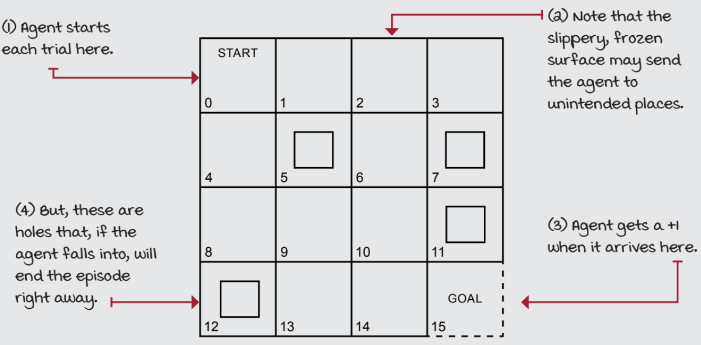
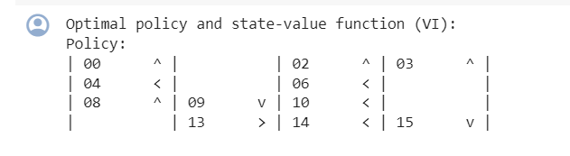
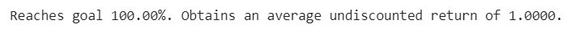
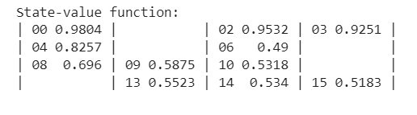

# VALUE ITERATION ALGORITHM

## AIM
To develop a Python program to find the optimal policy for the given MDP using the value iteration algorithm.

## PROBLEM STATEMENT
The FrozenLake environment in OpenAI Gym is a gridworld problem that challenges reinforcement learning agents to navigate a slippery terrain to reach a goal state while avoiding hazards. Note that the environment is closed with a fence, so the agent cannot leave the gridworld.

### States
5 Terminal States:
G (Goal): The state the agent aims to reach.
H (Hole): A hazardous state that the agent must avoid at all costs.
11 Non-terminal States:
S (Starting state): The initial position of the agent.
Intermediate states: Grid cells forming a layout that the agent must traverse.
### Actions
The agent can take 4 actions in each state:

LEFT

RIGHT

UP

DOWN
### Transition Probabilities
The environment is stochastic, meaning that the outcome of an action is not always certain.

33.33% chance of moving in the intended direction.
66.66% chance of moving in a orthogonal directions.
This uncertainty adds complexity to the agent's navigation.

### Rewards
+1 for reaching the goal state(G).
0 reward for all other states, including the starting state (S) and intermediate states.
### Episode Termination
The episode terminates when the agent reaches the goal state (G) or falls into a hole (H).

### Graphical Representation

## POLICY ITERATION ALGORITHM
Value iteration is a method of computing an optimal MDP policy and its value.

 It begins with an initial guess for the value function, and iteratively updates it towards the optimal value function, according to the Bellman optimality equation.

The algorithm is guaranteed to converge to the optimal value function, and in the process of doing so, also converges to the optimal policy.
#### The algorithm is as follows:
1. Initialize the value function V(s) arbitrarily for all states s.
2. Repeat until convergence:
    
    Initialize aaction-value function Q(s, a) arbitrarily for all states s and actions a.
    
    For all the states s and all the action a of every state:
    
       Update the action-value function Q(s, a) using the Bellman equation.
   
       Take the value function V(s) to be the maximum of Q(s, a) over all actions a.
   
       Check if the maximum difference between Old V and new V is less than theta.
   
       Where theta is a small positive number that determines the accuracy of estimation.
   
4. If the maximum difference between Old V and new V is greater than theta, then

    Update the value function V with the maximum action-value from Q.

    Go to step 2.

5. The optimal policy can be constructed by taking the argmax of the action-value function Q(s, a) over all actions a.
6. Return the optimal policy and the optimal value function.
## CODE FOR VALUE ITERATION FUNCTION
```
DEVELOPED BY: AKSHAYAA M
REGISTER NUMBER: 212222230009
```

## CODE FOR GOAL STATE(0,1)
```
desc=['SGFF','FHFH','FFFH','HFFF']
env = gym.make('FrozenLake-v1',desc=desc)
init_state = env.reset()
goal_state = 1
P = env.env.P
init_state
```

## VALUE ITERATION FUNCTION
```

def value_iteration(P, gamma=1.0, theta=1e-10):
    V = np.zeros(len(P), dtype=np.float64)
    while True:
      Q=np.zeros((len(P),len(P[0])),dtype=np.float64)
      for s in range(len(P)):
        for a in range(len(P[s])):
          for prob,next_state,reward,done in P[s][a]:
            Q[s][a]+=prob*(reward+gamma*V[next_state]*(not done))
      if(np.max(np.abs(V-np.max(Q,axis=1))))<theta:
        break
      V=np.max(Q,axis=1)
    pi=lambda s:{s:a for s , a in enumerate(np.argmax(Q,axis=1))}[s]
    return V, pi

# Finding the optimal policy
V_best_v, pi_best_v = value_iteration(P, gamma=0.99)

# Printing the policy
print('Optimal policy and state-value function (VI):')
print_policy(pi_best_v, P)

# printing the success rate and the mean return
print('Reaches goal {:.2f}%. Obtains an average undiscounted return of {:.4f}.'.format(
    probability_success(env, pi_best_v, goal_state=goal_state)*100,
    mean_return(env, pi_best_v)))

#printing the state value function
print_state_value_function(V_best_v, P, prec=4)
```
## OUTPUT:
### The Optimal Policy

### Success Rate

### State Value Function

## RESULT:

Thus, a Python program is developed to find the optimal policy for the given MDP using the value iteration algorithm.
